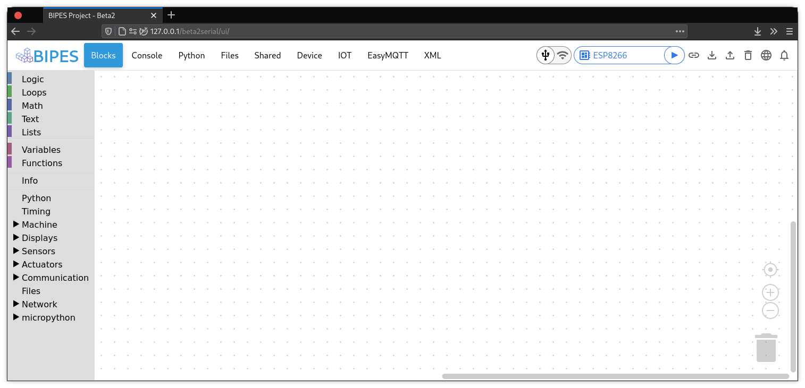

# BIPES: Block based Integrated Platform for Embedded Systems.
(Serial / USB Version)

More information at the project website:

https://bipes.net.br/

Use it online:

http://www.bipes.net.br/beta2serial/ui/

# More information

BIPES Project - Serial / Web Serial API 

Based on the original BIPES:

https://github.com/rafaelaroca/BIPES_ui_testing

http://bipes.net.br/beta2/ui/

This version uses Web Serial API to allow BIPES to directly access / control serial devices connected to the USB port, such as Micro:bit, Raspberry Pi Pico, mBed/STM32 boards, ESP8266, Franzininho Wifi (ESP32-S2) and ESP32 with USB connections, among others.
